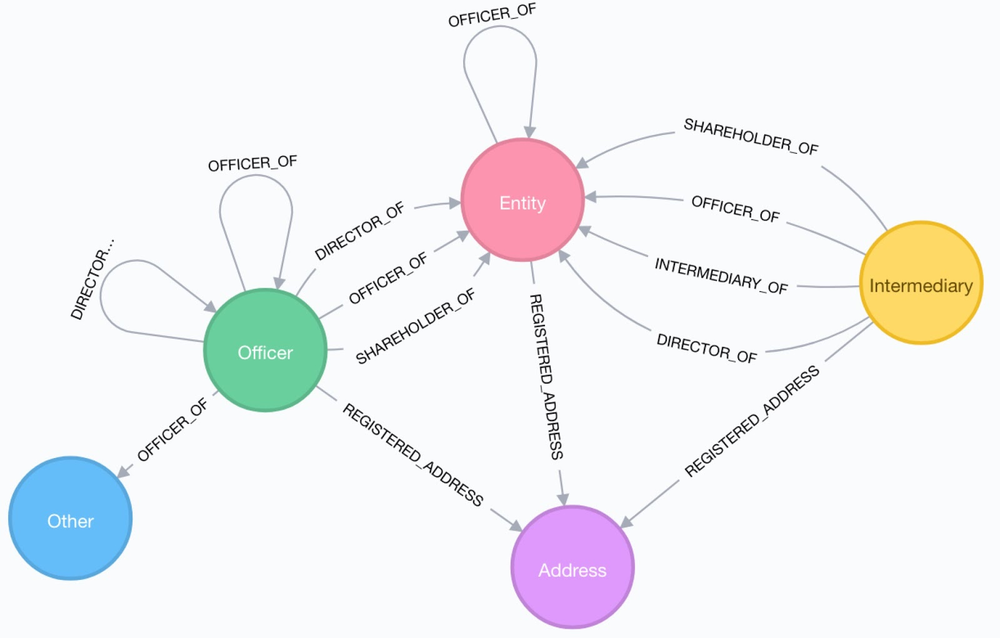
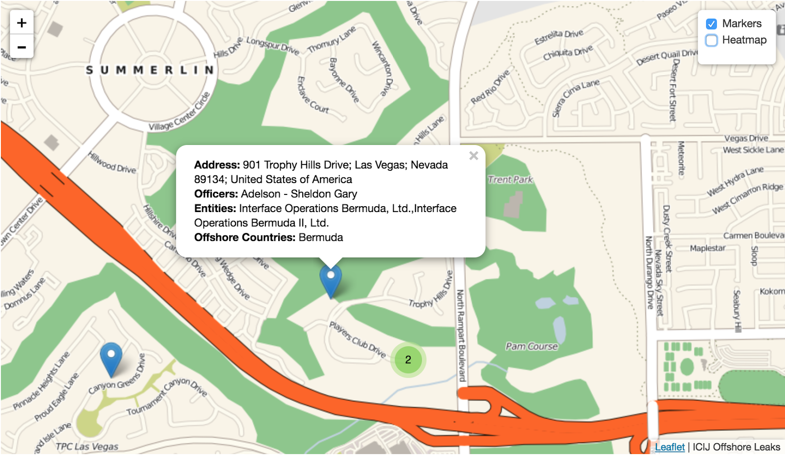
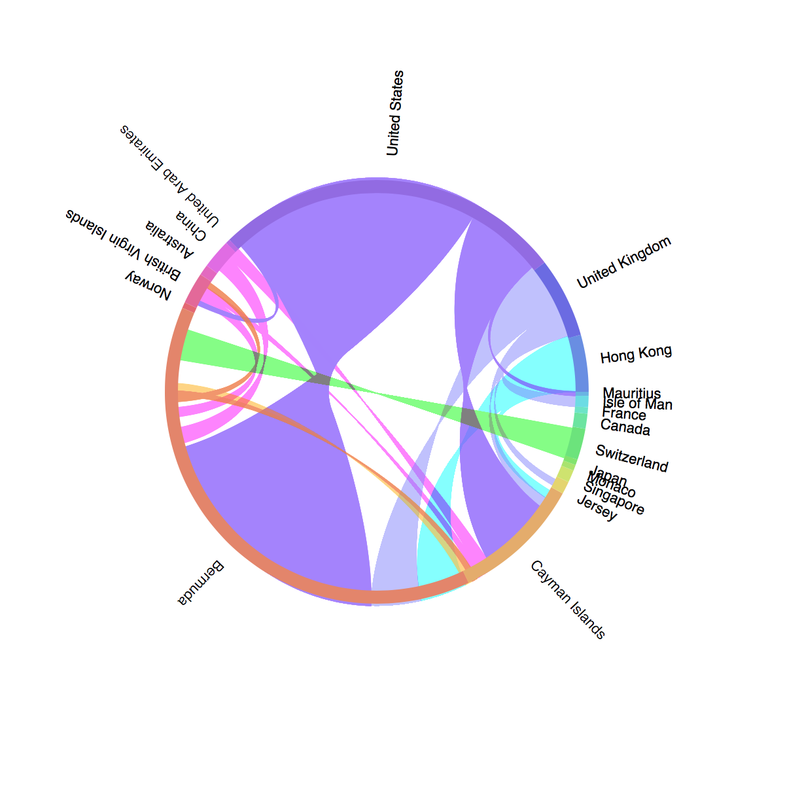
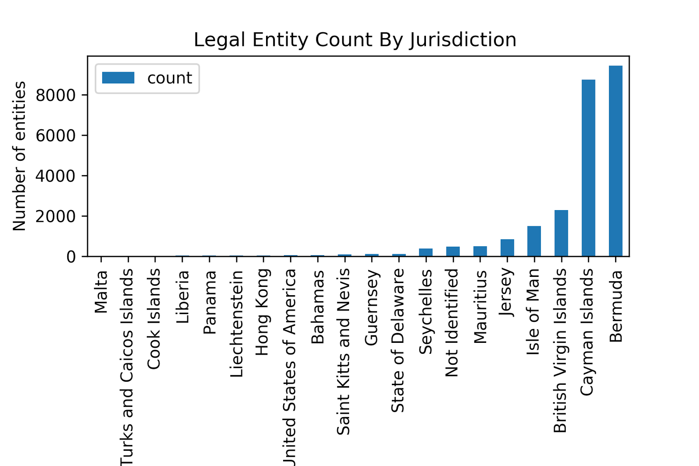

# pp-viz

Visualizing the Paradise Papers dataset with Neo4j. See the blog post [here.](https://neo4j.com/blog/depth-graph-analysis-paradise-papers/)

## Heatmap

An interactive map visualization of geocoded addresses in Paradise Papers.

[Try it live.](http://www.lyonwj.com/pp-viz/heatmap)

## Jupyter

Jupyter notebooks for creating visualizations with Neo4j, Python, matplotlib, and bokeh.

